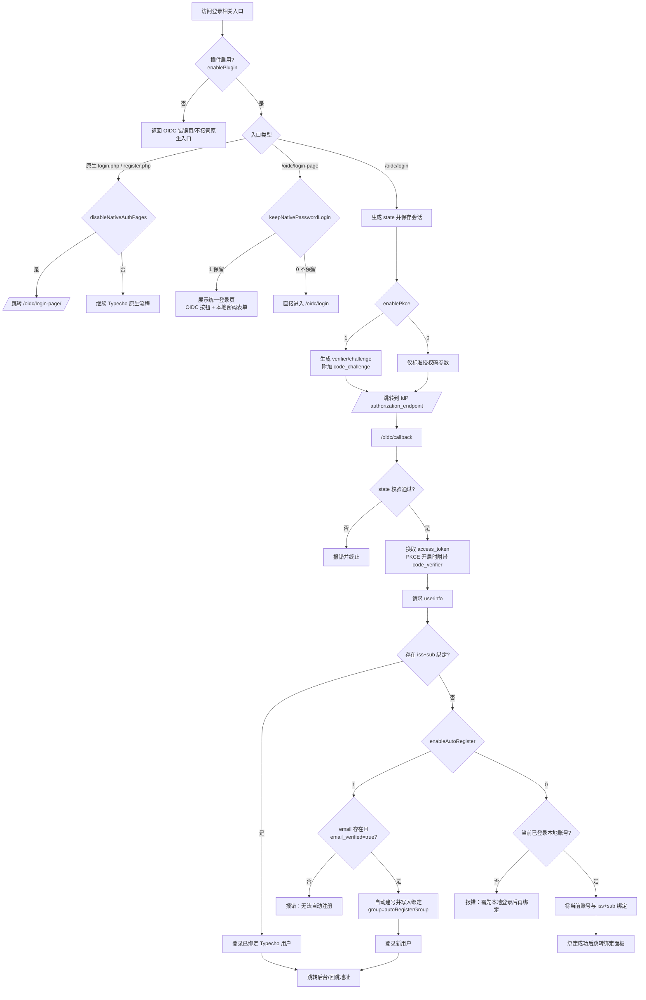

# OIDC

基于 OpenID Connect 在 Typecho 中实现单点登录（SSO）的插件，支持自动注册、账户绑定等功能。

## 功能概览

- 支持通过 OIDC（授权码流程）登录 Typecho
- 支持首次登录自动注册（可指定新用户组）
- 支持已登录本地账户后进行 OIDC 绑定
- 支持禁用 Typecho 原生登录/注册页并统一跳转到 OIDC 登录页
- 支持控制是否允许用户在绑定页执行解绑（默认不允许）

## 兼容性

已测试 Typecho 1.2.1

待测试 Typecho 1.3.0（理论兼容，欢迎反馈测试结果）

## 安装

```bash
cd typecho/usr/plugins
git clone https://github.com/CertStone/typecho-oidc-sso.git Oidc
```

## 使用

启用插件并配置好后，在需要的位置添加指向 `oidc/login` 的按钮即可。
如果需要完整的自定义登录页，可使用 `oidc/login-page`。

比如 `sidebar.php`

```php
<li><a href="<?php $this->options->index('oidc/login'); ?>"><?php _e('单点登录'); ?></a></li>
```

或 `login.php`

```php
<a href="<?php $options->index('oidc/login'); ?>"><?php _e('单点登录'); ?></a>
```

自定义登录页示例：

```php
<a href="<?php $options->index('oidc/login-page'); ?>"><?php _e('统一认证登录'); ?></a>
```

> 注意：若在插件设置中关闭「自动注册」，OIDC 首次登录用户需要先使用本地账号登录并在 OIDC 绑定管理页完成绑定。

## UI Preview
### 登录页（`/oidc/login-page`）

### 绑定页（`/admin/extending.php?panel=Oidc%2FPanel.php`）


## 插件配置项说明（后台）

### 必填项

1. `OIDC 发现文档 URL`
   - 例如：`https://idp.example.com/.well-known/openid-configuration`
2. `Client ID`
3. `Client Secret`

### 常用项

- `OIDC 系统名称`：登录页按钮文案展示名称（如“单点登录”）
- `Scope`：默认 `openid email profile`
- `PKCE 支持`：建议在 IdP 支持时开启
- `自动注册`：开启后，未绑定用户可自动创建 Typecho 账户（要求 `email_verified=true`）
- `OIDC 自动注册用户组`：可选 `subscriber / contributor / editor`
- `是否禁用 Typecho 原生登录和注册页`：开启后，访问原生 `login.php` / `register.php` 会跳转到 `/oidc/login-page`（兼容自定义后台目录）
- `是否保留 Typecho 原生账号登录功能`：
  - 保留：`/oidc/login-page` 同时展示“单点登录 + 本地账号登录”
  - 不保留：访问 `/oidc/login-page` 将直接跳转到单点登录，不再展示本地账号登录表单
- `账户中心 URL`：你的 IdP 账户中心地址（用于“前往账户中心设置”按钮）
- `账户中心登出 URL（可选）`：用于统一登出，开启接管时优先跳转该地址
  - 出于安全考虑，建议与“账户中心 URL”同域名
- `使用独立账户中心接管用户个人资料设置`：开启后，Typecho 个人设置页会隐藏“个人资料/密码修改/撰写设置”，改为“前往账户中心设置”按钮，并提示“重新登录后生效”
- `是否允许用户解绑 OIDC 账户`：默认“否”，适用于强制 SSO 场景

> 说明：出于安全考虑，自动注册用户组不建议直接使用高权限组。建议先以低权限组接入，再由管理员后台调整权限。

> 警告：
> “使用独立账户中心接管用户个人资料设置”必须在以下条件均满足时才会生效：
> 1. 已开启“禁用 Typecho 原生登录和注册页”
> 2. “是否保留 Typecho 原生账号登录功能”设置为“不保留”
> 3. “是否允许用户解绑 OIDC 账户”设置为“否”
> 4. 已正确填写“账户中心 URL”

## 强制 SSO 推荐配置

如果你希望用户只能通过 IdP 管理身份，建议如下：

1. 开启插件功能
2. 开启自动注册（建议开启，以避免首次登录用户无本地入口导致无法完成接入）
3. 设置 `OIDC 自动注册用户组`（通常为 `subscriber` 或 `contributor`）
4. 开启 `是否禁用 Typecho 原生登录和注册页`
5. 将 `是否保留 Typecho 原生账号登录功能` 设为“不保留”
6. 保持 `是否允许用户解绑 OIDC 账户 = 否`

这样可以实现：
- 原生登录/注册页不可用
- 账号生命周期由 IdP + OIDC 绑定关系主导
- 用户无法自行解除绑定绕过 SSO 策略

### 两个登录相关开关的语义

- `是否禁用 Typecho 原生登录和注册页`：控制原生 `login.php/register.php` 页面入口是否重定向到 `/oidc/login-page`
- `是否保留 Typecho 原生账号登录功能`：控制 `/oidc/login-page` 是否显示本地账号登录表单

> 注意：这两个开关主要控制“页面入口与展示层”。若要实现严格意义上的“仅允许 SSO、禁止一切密码登录请求”，还需在网关层（Nginx/Apache/WAF）限制原生登录 action 端点。

## 登录逻辑总览（按配置项分支）

便于你在改配置时快速判断行为变化。



### 配置项对登录行为影响表

| 配置项 | 默认值 | 开启/取值后的行为 | 关键代码位置 |
| --- | --- | --- | --- |
| `enablePlugin`（插件功能开关） | `1` | `0` 时 `/oidc/login`、`/oidc/callback`、`/oidc/login-page` 会走错误/不接管流程；`1` 时启用全部 OIDC 路由逻辑 | `Action::isPluginEnabled()`、`Plugin::shouldDisableNativeAuthPages()` |
| `disableNativeAuthPages`（禁用原生登录注册页） | `0` | `1` 时访问原生 `login.php/register.php` 会重定向到 `/oidc/login-page`；`0` 时不拦截原生入口 | `Plugin::interceptNativeAuthPages()` |
| `keepNativePasswordLogin`（保留本地密码登录） | `1` | `1`：`/oidc/login-page` 同时显示 OIDC 按钮与本地表单；`0`：`/oidc/login-page` 直接进入 OIDC 跳转 | `Action::loginPage()`、`LoginPage.php` |
| `enablePkce`（PKCE 支持） | `0` | `1` 时授权请求追加 `code_challenge`，回调换 token 时要求 `code_verifier`；`0` 时走普通授权码交换 | `Action::isPkceEnabled()`、`generatePkcePair()`、`getAccessToken()` |
| `enableAutoRegister`（自动注册） | `0` | 未绑定用户回调时：`1` 则尝试自动建号+绑定+登录；`0` 则进入“需先本地登录再绑定”分支 | `Action::processUserLogin()`、`autoRegisterUser()`、`handleBinding()` |
| `autoRegisterGroup`（自动注册用户组） | `subscriber` | 仅在自动注册成功时生效，决定新建 Typecho 用户组（仅允许 `subscriber/contributor/editor`） | `Action::getAutoRegisterGroup()` |
| `allowUserUnbind`（允许用户解绑） | `0` | 主要影响绑定面板“是否可解绑”；同时会影响“账户中心接管”是否满足前置条件（间接影响统一登出/资料同步路径） | `Panel.php`、`Action::isUserUnbindAllowed()`、`Action::isAccountCenterTakeoverEnabled()` |
| `enableAccountCenterTakeover`（账户中心接管） | `0` | 主要不改变首次登录主链路；但在满足前置条件时，会接管 profile 同步与 logout 统一登出跳转 | `Plugin::interceptProfilePageForAccountCenterTakeover()`、`Plugin::interceptNativeLogoutPage()`、`Action::buildUnifiedLogoutTarget()` |

## 账户中心接管个人资料（可选）

当“使用独立账户中心接管用户个人资料设置”开启且满足前置条件后：

1. 用户访问 Typecho 原生个人设置页时，会先通过 OIDC 拉取最新用户信息并同步到 Typecho（mail / screenName / url）
2. 页面中的“个人资料”“密码修改”“撰写设置”区域会被隐藏
3. 页面顶部显示“前往账户中心设置”按钮
4. 页面提示：在账户中心修改后，请重新登录以生效
5. 触发 Typecho 退出时，将统一跳转到账户中心/IdP 登出端点（若配置了账户中心登出 URL 则优先使用）

建议在 IdP 中确保以下字段稳定可用：

- `sub`（唯一用户标识）
- `email`（邮箱）
- `name`（昵称）
- `website`（个人主页，可选）

## IdP 配置说明

根据插件代码，当前 OIDC 回调地址固定为：

```
<你的站点地址>/oidc/callback
```

请将该地址加入 IdP 的 **Redirect URIs**。

建议同时配置：

- **Allowed Grant Types**：`authorization_code`（开启 PKCE 时也允许 PKCE）
- **Client Authentication**：`client_secret_basic`（与当前插件实现一致）
- **Scopes**：至少包含 `openid email profile`

为保证自动注册可用，IdP 侧应提供：

- `sub`（必须）：唯一用户标识
- `iss`（建议/通常由 discovery 提供）
- `email`（用于 Typecho mail）
- `email_verified=true`（自动注册前置条件）
- `name`（可选，映射 Typecho screenName）
- `website`（可选，映射 Typecho url）

本插件已支持统一登出：

- 当开启“账户中心接管”后，访问 Typecho 原生退出入口会被接管到 `/oidc/logout`
- `/oidc/logout` 会先执行 Typecho 本地退出，再尝试跳转：
  1. 后台配置的“账户中心登出 URL”（若已填写）
  2. OIDC discovery 中的 `end_session_endpoint`（自动拼接 `post_logout_redirect_uri`）
  3. 站点首页（兜底）
- 若 IdP 支持 RP-Initiated Logout，插件会附加 `id_token_hint`（当本次会话中可用时）以提高统一登出成功率

如果你在 IdP 中配置 **Post Logout Redirect URIs**，建议加入以下地址：

```
<你的站点地址>/
```

自定义登录页入口（用于展示现代化登录页）：

```
<你的站点地址>/oidc/login-page
```

## 权限与用户组建议

- `subscriber`：最小权限，适合普通成员
- `contributor`：可写草稿，不能直接发布
- `editor`：可管理内容
- `administrator`：最高权限（强烈不建议作为自动注册默认组）

建议默认使用低权限组，再通过后台审批或同步策略提升权限。


## 致谢

感谢 [typecho-oidc](https://github.com/he0119/typecho-oidc) 插件提供的思路和 OIDC 核心代码实现，当前插件在其基础上进行了重构和功能增强。

